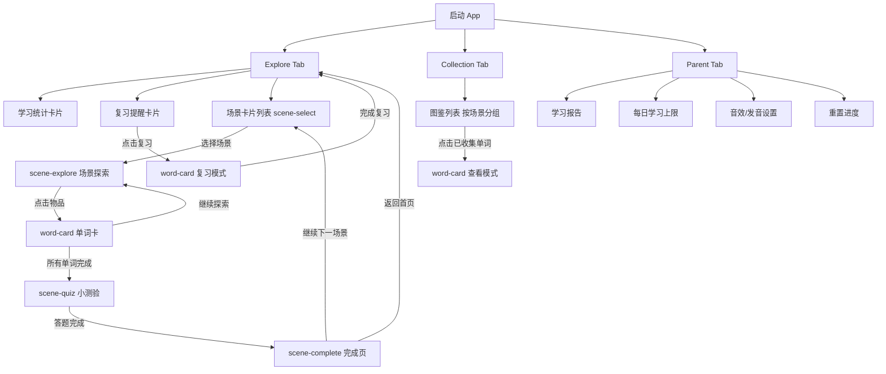

# DESIGN-V5.md — KidStart 产品设计文档

> 版本：V5 | 作者：娜美 🍊 | 日期：2026-03-23

---

## 1. 信息架构

### 三 Tab 结构

| Tab | 名称 | 功能 |
|-----|------|------|
| 1 | **Explore** | 学习统计 + 复习提醒 + 场景卡片入口（原 Growth 合并至此） |
| 2 | **Collection** | 单词图鉴，按场景分类，展示已收集/未收集 |
| 3 | **Parent** | 家长设置、学习报告、每日上限、音效开关 |

### 场景学习流（Scene Flow）

```
scene-select → scene-explore → word-card → scene-quiz → scene-complete
```

| 页面 | 说明 |
|------|------|
| **scene-select** | Explore Tab 内的场景卡片列表，选择一个场景进入 |
| **scene-explore** | 场景大图 + 可点击热区，点击物品进入单词卡 |
| **word-card** | 单词详情：图片、单词、音标、发音、例句、操作按钮 |
| **scene-quiz** | 场景内小测验：听音选图 / 看图选词，3-5 题 |
| **scene-complete** | 完成页：星星奖励 + 收集进度 + 返回/继续按钮 |

---

## 2. User Flow



---

## 3. 视觉 Spec

### 设计语言总则

| 属性 | 规范 |
|------|------|
| **背景** | 线性渐变，每个页面有独立渐变方向和色值 |
| **卡片** | 白底 `#FFFFFF`，圆角 `32rpx`，`box-shadow: 0 8rpx 32rpx rgba(0,0,0,0.08)`，**无 border** |
| **色板** | `#FF6B6B` 珊瑚红 / `#FF9F43` 暖橙 / `#FECA57` 明黄 / `#2ED573` 薄荷绿 / `#45AAF2` 天蓝 / `#a18cd1` 薰衣草紫 |
| **标题** | `font-size: 48rpx; font-weight: 700` |
| **正文** | `font-size: 28rpx; color: #2D3436`，副文本 `color: #636E72` |
| **按钮** | 渐变胶囊，`border-radius: 999rpx`，`height: 88rpx`，文字 `#FFFFFF 32rpx bold` |
| **动画** | `float`（上下浮动 3s loop）、`fadeInUp`（入场上移渐显 0.4s）、`sparkle`（星星闪烁 keyframe） |
| **CDN** | 所有静态资源 `https://cdn.onemilelab.com/kidstart/...` |

---

### 3.1 scene-select（场景选择 — Explore Tab 主体）

```
背景：linear-gradient(135deg, #a18cd1 0%, #45AAF2 50%, #2ED573 100%)
```

| 区域 | 规范 |
|------|------|
| **顶部统计卡片** | 白底卡片，内含三列：今日已学单词数 / 连续天数 / 总收集数；数字 `48rpx bold`，配色分别用 `#FF6B6B` / `#FF9F43` / `#2ED573`；动画 `fadeInUp delay 0.1s` |
| **复习提醒条** | 渐变背景 `#FF6B6B → #FF9F43`，圆角 `24rpx`，左侧 🔔 icon + 文字 `"你有 N 个单词需要复习"`，右侧胶囊按钮 `"去复习"`；无待复习时隐藏；动画 `fadeInUp delay 0.2s` |
| **场景卡片网格** | 2 列 grid，`gap: 24rpx`；每张卡片：白底圆角卡片，顶部场景插图 `height: 240rpx` + 底部场景名 `32rpx bold` + 进度条（渐变 `#45AAF2 → #2ED573`，高度 `12rpx`，圆角 `6rpx`）；已完成场景右上角 ⭐ 角标；动画 `fadeInUp delay index*0.05s` |
| **场景插图** | `https://cdn.onemilelab.com/kidstart/scenes/{scene-id}/cover.webp` |
| **底部 TabBar** | 固定底部，3 个 tab icon + label，选中态渐变色 `#45AAF2`，未选中 `#B2BEC3` |

---

### 3.2 scene-explore（场景探索）

```
背景：场景大图铺满屏幕
```

| 区域 | 规范 |
|------|------|
| **场景大图** | `width: 100vw; height: 100vh; object-fit: cover`，来源 `cdn.onemilelab.com/kidstart/scenes/{scene-id}/full.webp` |
| **可点击热区** | 绝对定位圆形/椭圆区域，`border: 4rpx solid rgba(255,255,255,0.6)`，`border-radius: 50%`；未探索：动画 `float` 上下浮动吸引点击；已探索：显示 ✅ 小角标，opacity 0.7 |
| **顶部导航栏** | 半透明黑底 `rgba(0,0,0,0.3)`，左侧返回箭头，中间场景名 `36rpx white`，右侧进度 `"3/8"` |
| **底部提示** | 半透明胶囊 `"点击物品学习新单词！"`，`fadeInUp`，3s 后 `fadeOut` |
| **物品点击反馈** | 点击时 `sparkle` 动画 + 缩放 `scale(1.1)` 0.2s |

---

### 3.3 word-card（单词卡）

```
背景：linear-gradient(180deg, #FECA57 0%, #FF9F43 100%)
```

| 区域 | 规范 |
|------|------|
| **单词卡片** | 白底卡片，居中，`width: 90vw`，`padding: 48rpx`，`border-radius: 32rpx` |
| **单词图片** | 卡片内顶部，`width: 400rpx; height: 400rpx; border-radius: 24rpx`，`cdn.onemilelab.com/kidstart/words/{word-id}.webp`；动画 `fadeInUp` |
| **单词文字** | 图片下方，`font-size: 56rpx; font-weight: 800; color: #2D3436`（**P0：确保深色，禁止浅色**） |
| **音标** | 单词下方，`font-size: 28rpx; color: #636E72` |
| **例句** | `font-size: 28rpx; color: #2D3436; line-height: 1.6`，关键词高亮 `color: #FF6B6B; font-weight: 600` |
| **发音按钮** | 圆形 `80rpx`，渐变 `#45AAF2 → #a18cd1`，内部 🔊 icon `40rpx white`，点击播放音频，`sparkle` 动画 |
| **操作按钮区** | 卡片底部，**两个渐变胶囊按钮**并排，`gap: 24rpx`；左 `"再听一次"` 渐变 `#45AAF2 → #a18cd1`；右 `"下一个"` 渐变 `#2ED573 → #45AAF2`；**P0：按钮必须有渐变背景色 + 白色文字，严禁透明/空白** |
| **进度指示** | 卡片上方小点 `dot indicator`，当前点高亮 `#FF6B6B`，其余 `#DFE6E9` |

**⚠️ P0 样式强制规则：**
```css
.word-card-btn {
  background: linear-gradient(135deg, #2ED573 0%, #45AAF2 100%);
  color: #FFFFFF;
  font-size: 32rpx;
  font-weight: 700;
  border: none;
  border-radius: 999rpx;
  height: 88rpx;
  min-width: 240rpx;
}
.word-card-title {
  color: #2D3436;
  font-weight: 800;
}
```

---

### 3.4 scene-quiz（场景测验）

```
背景：linear-gradient(135deg, #FF6B6B 0%, #FECA57 100%)
```

| 区域 | 规范 |
|------|------|
| **题目区** | 顶部白底卡片，题目文字 `36rpx bold #2D3436`；听音选图模式：显示 🔊 大按钮 + `"听一听，选出正确的图片"`；看图选词模式：显示图片 + `"这是什么？"` |
| **选项区** | 2×2 grid，白底卡片，每个选项 `padding: 32rpx`；图片选项 `200rpx × 200rpx`，文字选项 `32rpx`；未选中默认态，选中高亮边框 `4rpx solid #45AAF2` |
| **正确反馈** | 选项卡片变绿 `background: rgba(46,213,115,0.15)`，显示 ✅ + `sparkle` 动画，播放正确音效 |
| **错误反馈** | 选项卡片抖动 `shake 0.3s`，变红 `background: rgba(255,107,107,0.15)`，正确答案同时高亮绿色 |
| **进度条** | 顶部渐变进度条 `#2ED573 → #45AAF2`，`height: 12rpx`，跟随答题进度 |
| **题号** | `"第 2/5 题"` 右上角 `28rpx #636E72` |

---

### 3.5 scene-complete（完成页）

```
背景：linear-gradient(180deg, #2ED573 0%, #45AAF2 100%)
```

| 区域 | 规范 |
|------|------|
| **庆祝动画** | 顶部星星 + 彩带 lottie 动画，`sparkle` 持续闪烁 |
| **成绩卡片** | 白底卡片居中；标题 `"太棒了！"` `48rpx bold #2D3436`；星星评级（1-3 星）`80rpx` 金色；统计：`正确率 N%` / `新学 N 个单词` / `用时 N 分钟`，每项一行，icon + 数字 `36rpx bold` + 描述 `28rpx` |
| **收集提示** | `"你收集了 3 个新伙伴！"` + 收集到的单词小图横排 `120rpx` 圆角 |
| **按钮组** | 纵向排列；主按钮 `"继续探索下一场景"` 渐变 `#FF9F43 → #FF6B6B`；次按钮 `"回到首页"` 白底 + 文字色 `#45AAF2`，`border: 2rpx solid #45AAF2` |

---

### 3.6 collection（图鉴 — Tab 2）

```
背景：linear-gradient(180deg, #FECA57 0%, #FF9F43 100%)
```

| 区域 | 规范 |
|------|------|
| **页面标题** | `"我的图鉴"` `48rpx bold #2D3436`，右侧总进度 `"42/120"` |
| **场景分组** | 按场景分 section，section 标题 `32rpx bold` + 场景 icon，右侧 `"8/12"` |
| **单词格子** | 每行 4 个，`gap: 16rpx`；已收集：彩色图片 `160rpx × 160rpx` 圆角 `16rpx` + 底部单词名 `24rpx`；未收集：灰色剪影 + `"???"` + `opacity: 0.4` |
| **点击已收集** | 弹出 word-card 查看模式（无操作按钮，只有发音 + 关闭） |
| **空状态** | 全灰时显示 `"快去探索场景收集新伙伴吧！"` + 跳转 Explore 按钮 |

---

### 3.7 parent（家长设置 — Tab 3）

```
背景：linear-gradient(180deg, #a18cd1 0%, #45AAF2 100%)
```

| 区域 | 规范 |
|------|------|
| **入口验证** | 简单数学题 `"12 + 7 = ?"` 防止儿童误操作 |
| **学习报告卡片** | 白底卡片；本周学习天数柱状图（7 列，渐变 `#45AAF2 → #2ED573`）；总学习单词数、总学习时长、平均正确率 |
| **设置列表** | 白底卡片，列表项 `height: 96rpx`，左 icon + 文字 `30rpx`，右侧 switch/箭头 |
| **设置项** | 每日学习上限（slider 5-30 个单词）/ 发音模式（美式/英式）/ 音效开关 / 背景音乐开关 / 重置学习进度（红色文字，二次确认弹窗） |
| **关于** | 版本号 + 隐私政策链接 |

---

## 4. P0 修复清单

| # | 问题 | 页面 | 修复方案 | 验收标准 |
|---|------|------|----------|----------|
| 1 | **按钮空白不可见** | word-card | 按钮必须设置 `background: linear-gradient(...)` 渐变背景 + `color: #FFFFFF`，删除任何 `background: transparent` 或缺省样式 | 按钮在所有机型上可见，有渐变色背景和白色文字 |
| 2 | **文字太淡** | word-card | 单词标题 `color: #2D3436; font-weight: 800`，禁止使用 `#B2BEC3` 等浅灰色；例句 `color: #2D3436` | 单词文字在浅色和深色背景上均清晰可读 |
| 3 | **未适配 V5 设计** | scene-select | 按本文档 3.1 节重写 scene-select，加入统计卡片 + 复习提醒 + 新渐变背景 + 卡片样式 | 页面包含统计、复习提醒、场景卡片三个区块，样式符合 V5 spec |
| 4 | **Growth Tab 冗余** | 全局 | 删除 Growth Tab，将学习统计和复习提醒合并到 Explore Tab 顶部；TabBar 改为 3 个 Tab | TabBar 只有 Explore / Collection / Parent 三个入口，无 Growth |

---

*娜美 🍊 签收，执行交给索隆和弗兰奇。有问题找我。*
