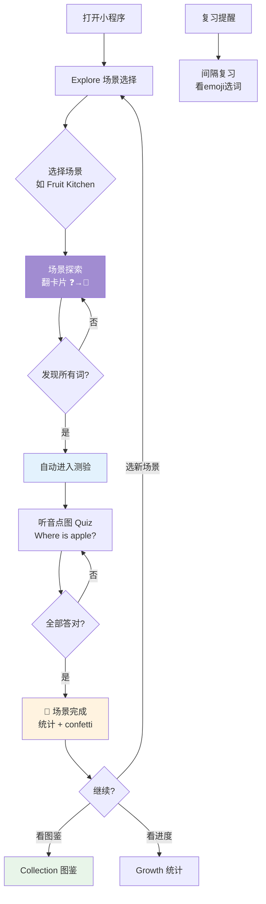

# 🍊 KidStart V5 设计文档 — 信息架构 & User Flow & 视觉规范

> 产品负责人：娜美 | 2026-03-23

---

## 一、信息架构（IA）

```
KidStart
├── 🏠 Explore (Tab 1 · pages/scene-select) — 场景选择首页
│   ├── 🌈 场景探索 (pages/scene-explore) — 翻卡片发现单词
│   │   └── 📖 单词卡 (pages/word-card) — 看图听音跟读
│   ├── 🧠 场景测验 (pages/scene-quiz) — 听音点图
│   │   └── 🎉 场景完成 (pages/scene-complete) — 庆祝 + 统计
│   └── (旧) 首页 index / lesson / complete — 主题式学习流（待废弃或保留）
│
├── 📊 Growth (Tab 2 · pages/progress) — 学习统计
│
├── 📖 Collection (Tab 3 · pages/collection) — 图鉴收集
│   └── 🍎 Fruit Gallery (pages/fruit-gallery) — 水果详情
│
└── 👨‍👩‍👧 Parent (Tab 4 · pages/parent) — 家长设置 (PIN保护)
```

### 两套学习流并存
| 流程 | 入口 | 页面链路 | 说明 |
|------|------|----------|------|
| **场景式** | Tab 1 scene-select | scene-select → scene-explore → word-card → scene-quiz → scene-complete | 当前主推，翻卡片+听音点图 |
| **主题式** | (旧) index 页 | index → lesson → review → complete | 传统课程模式，仍可访问 |

---

## 二、User Flow



---

## 三、每个页面的 V5 视觉规范

### 🎨 全局设计语言

| 属性 | 值 |
|------|-----|
| 背景 | 页面级渐变（每个页面不同色调） |
| 卡片 | 白底 `#FFFFFF` · 圆角 `32rpx` · `box-shadow: 0 8rpx 32rpx rgba(0,0,0,0.08)` · **无 border** |
| 主色板 | 🔴 `#FF6B6B` 🟠 `#FF9F43` 🟡 `#FECA57` 🟢 `#2ED573` 🔵 `#45AAF2` 🟣 `#a18cd1` |
| 字体 | 标题 `48rpx/800` · 正文 `28-34rpx/600` · 辅助 `24rpx` |
| 动画 | `float` 3s循环 · `fadeInUp` 0.6s进场 · `sparkle` 2s闪烁 |
| 按钮 | 渐变胶囊 `border-radius: 50rpx` · `#FF9F43 → #FF6B6B` · `box-shadow` |
| 图标容器 | `64rpx` 圆角方块 `border-radius: 20rpx` · 渐变背景 |

---

### ① 场景选择 `scene-select`（Tab 首页）

**当前**：Swiper 卡片轮播 + 奶茶色背景
**V5 目标**：

- 背景：`linear-gradient(180deg, #FFF3E0, #E8F5E9, #E3F2FD)`
- 场景卡片：白底 32rpx 圆角 + shadow，内部渐变色 cover 区域
- 场景 emoji 加 `float` 动画
- 进入按钮：渐变胶囊 `#FF9F43 → #FF6B6B`
- 星星评级保留但改用 emoji ⭐ 替代 SVG
- 每张卡片 `fadeInUp` 进场

**GAP**：
- ❌ 背景仍是纯色
- ❌ 卡片无 shadow
- ❌ 无进场动画

---

### ② 场景探索 `scene-explore`

**效果图**：紫粉渐变 + ❓翻卡片 + ✨sparkle
**当前实现**：✅ 基本对齐

**GAP**：
- ⚠️ sparkle 太小太淡，需要放大到 `40rpx` 并增加 opacity
- ⚠️ 翻卡片下方缺少进度文字（如 "3/8 已发现"）的白色样式

---

### ③ 单词卡 `word-card`

**效果图**：黄橙渐变 + 大 emoji/图片 float + 白色大字 + 毛玻璃播放按钮
**当前实现**：渐变 OK，但细节差距大

**GAP**：
- ❌ **按钮显示为空白圆圈** — SVG icon 白色在毛玻璃白色背景上不可见。应改为 emoji + 文字标签
- ❌ **单词文字 "peach" 几乎不可见** — 需要 `font-weight: 800` + 更重的 `text-shadow: 0 4rpx 16rpx rgba(0,0,0,0.25)`
- ❌ **音标太小** — mockup 是 `28rpx`，当前 `16rpx`
- ❌ **图片无 float 动画** — 需要 `animation: float 3s ease-in-out infinite`
- ⚠️ 用了植物学百科图而非 Noto Emoji 风格 — 这是 CDN 素材本身的风格，可接受

---

### ④ 图鉴 `collection`

**效果图**：3列网格 + 白色圆角卡片 + ✅/🔒 标记
**当前实现**：✅ 基本对齐

**GAP**：
- ⚠️ 页面背景需改为渐变
- ⚠️ section header 样式需更鲜艳

---

### ⑤ 测验 `scene-quiz`

**效果图**：大 emoji 题目 + 圆角选项卡 + 正确高亮渐变
**当前实现**：听音点图模式（点 hotspot），和效果图的选择题模式不同

**GAP**：
- ⚠️ 当前是 hotspot 点图模式，效果图是 4 选 1 选择题。两种模式都 OK，但视觉需统一到 V5 风格
- ❌ 底栏按钮同样有 SVG 白色不可见问题

---

### ⑥ 完成页 `scene-complete` / `complete`

**效果图**：confetti 飘落 + 大号 emoji bounceIn
**当前实现**：✅ 弗兰奇已加 confetti + bounceIn

**GAP**：
- ⚠️ 检查 confetti 颜色是否用了彩虹色板

---

### ⑦ 首页 `index`（主题式入口）

**效果图**：渐变背景 + 问候 + 圆角主题卡片 + 渐变图标方块
**当前实现**：索隆已改

**GAP**：
- ⚠️ 主题图标是否真的显示为渐变方块（需真机确认）
- ⚠️ `border-left` 是否彻底去除

---

### ⑧ 复习页 `review`

**V5 目标**：卡片样式对齐
**当前实现**：弗兰奇已改

**GAP**：
- ⚠️ 需真机确认视觉效果

---

## 四、P0 修复清单（必须立即修）

| # | 页面 | 问题 | 修复方案 |
|---|------|------|----------|
| 1 | word-card | 三个按钮空白不可见 | SVG image → emoji + text 标签，毛玻璃背景加深到 `rgba(0,0,0,0.15)` |
| 2 | word-card | 单词文字几乎不可见 | `font-weight: 800` + `text-shadow: 0 4rpx 16rpx rgba(0,0,0,0.25)` + `font-size: 48rpx` |
| 3 | word-card | 音标太小 | `16rpx → 28rpx`，颜色 `rgba(255,255,255,0.85)` |
| 4 | word-card | 图片无 float | 加 `animation: float 3s ease-in-out infinite` |
| 5 | scene-select | 背景无渐变 | 加三段渐变 |
| 6 | scene-select | 卡片无 shadow/动画 | 加 shadow + fadeInUp |
| 7 | scene-quiz | 底栏按钮不可见 | 同 word-card 修复方案 |
| 8 | 全局 | tabBar 未更新 | `navigationBarBackgroundColor` 改为渐变起始色 `#FFF3E0` |

## 五、设计原则

1. **6 岁视角** — 一切为小朋友服务。大字、亮色、明确反馈
2. **一致性** — 所有页面共用一套设计语言，不能有的渐变有的纯色
3. **少即是多** — 每个页面一个核心操作，不要塞太多元素
4. **声音优先** — 这是语言学习 app，视觉引导点击，但核心是听和说
